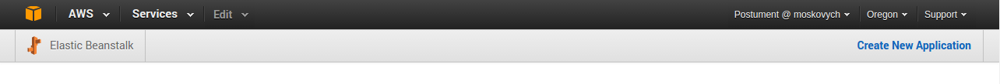

# AWS

## Create Golang AppService as AWS Elastic Beanstalk Application

### Amazon Console [Elastic Beanstalk page](http://console.aws.amazon.com/elasticbeanstalk/)

- Create new app

    

  - Set service name and description
  - Create web server environment
  - Choose Go language(current version 1.5)
  - Select application:
    - Sample App
    - From S3 bucket
    - Upload zip file (more details on the next slides)
  - Configure deployment preferences
  - Configure environment(name, url)
  - Additional resources(Network, DB connection)
  - Instance configuration(size, SSH key, notifications, health-check…)
  - Configure tags
  - VPC
  - Permissios(IAM role)

### Elastic Beanstalk CLI

- Install eb-cli with:

        pip install awsebcli

- Init eb project with:

        eb init

- Follow next prompts to:
  - set region
  - set aws credentials
  - choose application name
  - choose programming language environment
  - choose programming language version
  - setup ssh

- Create environment with:

        eb create {env name}

- Deploy new application version:

        eb deploy {env name}

