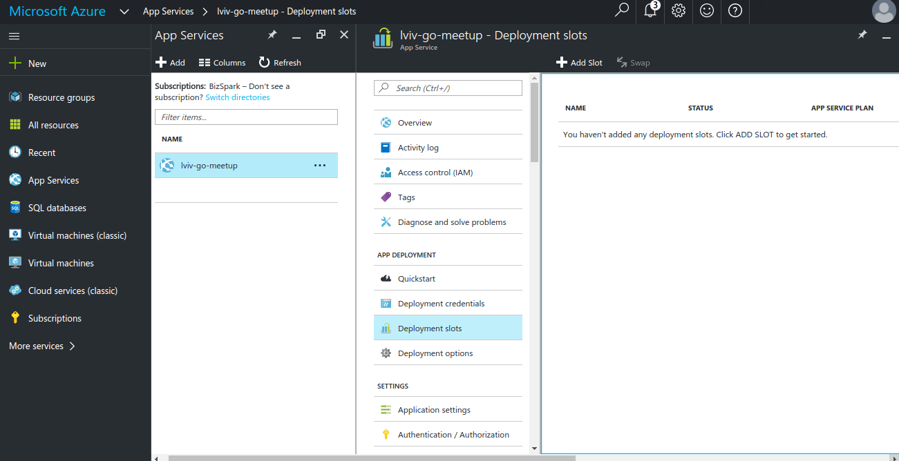

# Microsoft Azure Demo

## Create Golang AppService as Microsoft Azure WebService

### Azure Portal [AppService page](https://portal.azure.com/#create/Microsoft.WebSite)

- Add new WebApp

    

- Configure WebApp:
  - Choose Web App name
  - Choose or create new Resource Group
  - Choose or create new Service Plan
  - Enable/Disable App Insights(does not support Golang apps)

    

### Azure CLI

- Install azure-cli with npm:

        sudo npm install -g azure-cli

- Login to the console with:

        azure login

- Create resource group:

        azure group create -n golang-example -l westeurope

- Create Service Plan:

        azure appserviceplan create -n webapp-test -g golang-example -l  westeurope --tier S1

- Create webapp:

        azure webapp create golang-example golang-webapp westeurope webapp-test

## Deploy your app

- Open deployment options:

    *App Services* **->** *{AppServiceName}* **->** *Deployment Options*

- Configure deployment source
  - Choose one of supported deployment sources
  - Authorize deployment source;
  - Choose Repo and Branch to deploy

    

- (Optional) Create deployment slots for different environments(dev/stage/prod).

    

## Additional tweaks

- Application environment variables can be set via:

   *App Services* **->** *{WebServiceName}* **->** *Application settings*
- In order to connect WebService to the cloud VMs, we need to:
  - Create Virtual Network
  - Attach VMs network interfaces to that VirtualNetwork
  - Create Virtual Network Gateway for WebService
  - Attach Virtual Network Gateway to the WebService
- Connection to the databases or storage blobs can be set via: 

   *App Services* **->** *{WebServiceName}* **->** *Data Connections*
- Exploring WebService guts could be done via:

  *App Services* **->** *{WebServiceName}* **->** *Advanced Tools*

  or

  https://{WebServiceName}.scm.azurewebsites.net/ 
